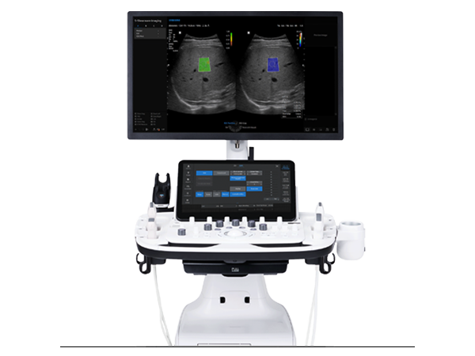

# SG Biocon Website

One-page lead-capture site for SG Biocon FZ-LLC, an authorized distributor for Samsung Healthcare in West Africa.

## Local development

### Static site (no API)
Open `index.html` directly in a browser. Form submission will fail without the API, but all UI works.

### Local site with form submission

Run:

```bash
npm run dev
```

This starts `http://localhost:4173` and serves both the website and `/api/lead`.

### With API routes (recommended)
Install the Vercel CLI and run:

```bash
npm i -g vercel
vercel dev
```

This starts a local server at `http://localhost:3000` with the `/api/lead` route active.

You'll need a `.env.local` file:

```
MAKE_WEBHOOK_URL=https://hook.eu1.make.com/your-webhook-id-here
```

## Environment variables

| Variable | Where to set | Description |
|---|---|---|
| `MAKE_WEBHOOK_URL` | Vercel project → Settings → Environment Variables | The Make.com webhook URL that receives lead data and routes to Google Sheets + email |

Set this in Vercel **before** the production deploy, or leads will return a 500 error.

## Deployment

1. Push this repo to GitHub.
2. Go to [vercel.com](https://vercel.com) → New Project → Import the GitHub repo.
3. Vercel auto-detects the setup. No build command needed (static site).
4. Add `MAKE_WEBHOOK_URL` under Settings → Environment Variables.
5. Add `sgbiocon.com` under Settings → Domains.

## GoDaddy DNS records

After adding the domain in Vercel, go to Vercel → Domains → sgbiocon.com to get the exact values. The records will look like:

| Type | Name | Value |
|---|---|---|
| `A` | `@` | `76.76.21.21` |
| `CNAME` | `www` | `cname.vercel-dns.com` |

Paste these into GoDaddy → DNS Management. Propagation takes a few minutes to an hour.

## Branding and product images

The site logo is `logo_sg.png` and is used in the navigation and footer. Replace that file with a final client-approved asset if needed, keeping the same filename to avoid code changes.

Product images live in `images/` and are referenced directly from `index.html` by each product card and variant button. The card layout is designed for contained product shots, so transparent PNG/WebP device renders should not be cropped.

To swap the hero product image, update the image inside `.hero__product-frame`:

```html

```

## Form flow

`/api/lead` (Vercel serverless) → Make.com webhook → Google Sheets row + email notification.

The Make.com scenario, Sheets connection, and email module are configured in the client's Make account separately.
